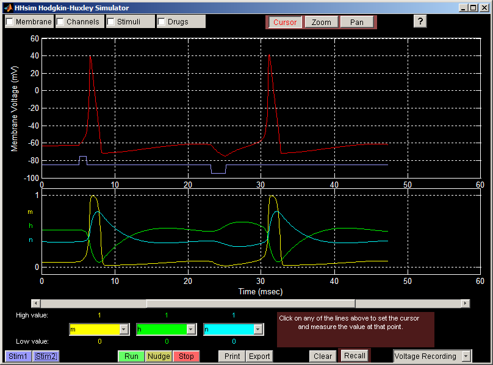

# HHsim — графический симулятор Ходжкина–Хаксли (русская версия)

**HHsim** — графическая модель участка возбудимой мембраны нейрона на основе уравнений
Ходжкина–Хаксли. Программа даёт полный доступ к параметрам Ходжкина–Хаксли, параметрам
мембраны, параметрам стимула и концентрациям ионов. В отличие от NEURON или GENESIS —
гораздо более сложных исследовательских инструментов — HHsim создан как простая учебная
программа для курсов нейрофизиологии: интерфейс осваивается за пару минут.

Это неофициальная русская версия **3.7-ru**, основанная на HHsim 3.7 (27 августа 2025 г.).
Переведён интерфейс программы и встроенная справка. Программа работает в свободной среде
**GNU Octave** (лицензия MATLAB не нужна) и по-прежнему работает в MATLAB.

* Авторы оригинала: David S. Touretzky, Mark V. Albert, Nathaniel D. Daw, Alok Ladsariya,
  Mahtiyar Bonakdarpour (Carnegie Mellon University).
* Официальный (английский) сайт: <https://www.cs.cmu.edu/~dst/HHsim/>



*Снимок экрана оригинальной (английской) версии.*

## Установка

Готовые файлы находятся на странице [Releases](https://github.com/rem-aster/HHsim/releases/latest).

| Система | Файл | Что нужно ещё |
|---|---|---|
| Windows 10/11 (64-бит) | `HHsim-3.7-ru-Windows-Installer.exe` | ничего: GNU Octave встроен в установщик |
| macOS 11+ (Apple Silicon и Intel) | `HHsim-3.7-ru-macOS.zip` | GNU Octave из Homebrew |
| Linux и другие | `HHsim-3.7-ru-source.zip` | GNU Octave 8+ (или MATLAB R2020a+) |

### Windows

1. Скачайте и запустите `HHsim-3.7-ru-Windows-Installer.exe`. Права администратора не нужны.
   Если Windows SmartScreen предупредит о неизвестном издателе, нажмите
   «Подробнее» → «Выполнить в любом случае» (установщик не подписан сертификатом).
2. Следуйте указаниям установщика. По умолчанию программа ставится в `C:\HHsim`:
   GNU Octave надёжнее работает из пути без пробелов и русских букв. Установка занимает
   около 1,5 ГБ на диске.
3. Запускайте HHsim ярлыком в меню «Пуск» → HHsim (или на рабочем столе).
   Вместе с программой открывается окно сообщений Octave — не закрывайте его во время работы.

Удалить программу можно через «Параметры» → «Приложения» или ярлык «Удалить HHsim».

### macOS

1. Скачайте `HHsim-3.7-ru-macOS.zip`, распакуйте и перетащите `HHsim.app` в папку «Программы».
2. Установите GNU Octave через [Homebrew](https://brew.sh/ru/): в Терминале выполните
   `brew install octave`. Если Octave не установлен, HHsim при запуске сам предложит
   установить его.
3. При первом запуске щёлкните по `HHsim.app` правой кнопкой мыши (или с клавишей Control),
   выберите «Открыть» и подтвердите — приложение не подписано сертификатом Apple.
   Если macOS не даёт его открыть: «Системные настройки» → «Конфиденциальность и
   безопасность» → «Всё равно открыть», либо в Терминале
   `xattr -dr com.apple.quarantine /Applications/HHsim.app`.

### Linux (и запуск из исходного кода на любой системе)

1. Установите GNU Octave 8 или новее: `sudo apt install octave` (Ubuntu/Debian),
   `sudo dnf install octave` (Fedora) или с сайта <https://octave.org/download>.
2. Распакуйте `HHsim-3.7-ru-source.zip` (или клонируйте этот репозиторий) и запустите
   `./hhsim.sh`. Другой способ — запустить Octave, перейти в каталог `code` и ввести `hhsim`.

В MATLAB (R2020a или новее): перейдите в каталог `code` и введите `hhsim`.

## Как пользоваться

Подробное руководство встроено в программу (кнопка **«?»** в главном окне) и лежит в
[`code/help/`](code/help): [руководство](code/help/guide.html),
[управление курсором](code/help/cursor.html), [фиксация потенциала](code/help/vclamp.html),
[упражнения](code/help/exercises.html).

Коротко:

* **Главное окно.** На верхнем графике красным показан мембранный потенциал, синим — стимул
  (импульсы тока). На нижнем — три переменные (по умолчанию m, h, n); их выбирают
  жёлтое, зелёное и голубое меню под графиком.
* Фиолетовые кнопки **Стим1** и **Стим2** подают деполяризующий и гиперполяризующий
  импульсы. Флажки **Мембрана**, **Каналы**, **Стимулы**, **Препараты** открывают окна
  параметров.
* Моделирование запускается при подаче стимула или изменении параметра и останавливается,
  когда потенциал выходит на асимптоту. **Шаг** продвигает его ещё на несколько шагов,
  **Пуск** / **Стоп** включают и выключают непрерывный режим, **Очистить** стирает графики.
* Режимы **Курсор** / **Масштаб** / **Сдвиг**. Щелчок по линии ставит курсор, значение видно
  на панели справа внизу; кнопки `<` `>` сдвигают курсор на шаг, `<<` `>>` — к ближайшему
  экстремуму, **пер.** переводит его на другую линию. **Запомнить** сохраняет состояние
  модели, **Вернуть** возвращает к нему.
* **Печать** сохраняет графики в EPS, **Экспорт** — данные в текстовую таблицу (UTF-8).
* Меню в правом нижнем углу переключает режимы **Регистрация** и **Фиксация потенциала**
  (voltage clamp) — в последнем окно «Стим. ФП» задаёт протокол из поддерживаемого
  потенциала и трёх ступеней.

## Об уравнениях Ходжкина–Хаксли (материалы на английском)

* [Channeling with Bard](https://www.cs.cmu.edu/~dst/HHsim/bard-channels.pdf) —
  онлайн-учебник G. Bard Ermentrout.
* [Biophysics of Computation](https://christofkoch.com/biophysics-book/), Christof Koch
  ([глава 6](https://christofkoch.files.wordpress.com/2014/01/hodgkin_huxley.pdf)).
* [Theoretical Neuroscience](https://boulderschool.yale.edu/sites/default/files/files/DayanAbbott.pdf),
  Peter Dayan и Larry F. Abbott (глава 5).
* [A Simple Sodium–Potassium Gate Model](https://web.archive.org/web/20040904063242/https://www.ces.clemson.edu/~petersj/BioEng/SimpleGates/index.html),
  James K. Peterson.

## Для разработчиков

| Путь | Содержимое |
|---|---|
| [`code/`](code) | Исходный код (Octave/MATLAB) и встроенная справка `code/help/` |
| [`packaging/`](packaging) | Сборка установщиков: [`windows/build.sh`](packaging/windows/build.sh), [`macos/build.sh`](packaging/macos/build.sh), загрузчик `start_hhsim.m` |
| [`tests/smoke_test.m`](tests/smoke_test.m) | Автоматическая проверка: запуск, спайк после Стим1, фиксация потенциала |
| [`.github/workflows/build.yml`](.github/workflows/build.yml) | CI: проверка в Octave, сборка и проверка установщиков, публикация выпуска |

Установщики собираются без MATLAB и без лицензий:

```sh
# Windows-установщик (собирается и на Linux): нужны curl, 7z, makensis
sudo apt install curl p7zip-full nsis
packaging/windows/build.sh          # -> dist/HHsim-3.7-ru-Windows-Installer.exe

# macOS-приложение (собирается на любой ОС): нужен zip
packaging/macos/build.sh            # -> dist/HHsim-3.7-ru-macOS.zip

# проверка в Octave (на сервере без экрана — через xvfb-run)
xvfb-run octave --no-gui --eval "addpath('tests'); smoke_test"
```

Чтобы опубликовать выпуск, отправьте тег: `git tag v3.7-ru && git push origin v3.7-ru` —
workflow соберёт файлы и прикрепит их к GitHub Release.

Изменения относительно оригинальной версии 3.7 перечислены в [`code/CHANGES`](code/CHANGES).
Логика моделирования не менялась.

## Лицензия

GNU General Public License версии 2 или более поздней — см. [`code/COPYING`](code/COPYING)
(оригинальный английский текст). Установщик для Windows содержит GNU Octave
(<https://octave.org>, GPL v3+).

Работа над оригиналом частично поддержана грантом Национального научного фонда США (NSF)
DGE-9987588. Любые мнения, выводы или рекомендации принадлежат авторам и не обязательно
отражают точку зрения NSF.
