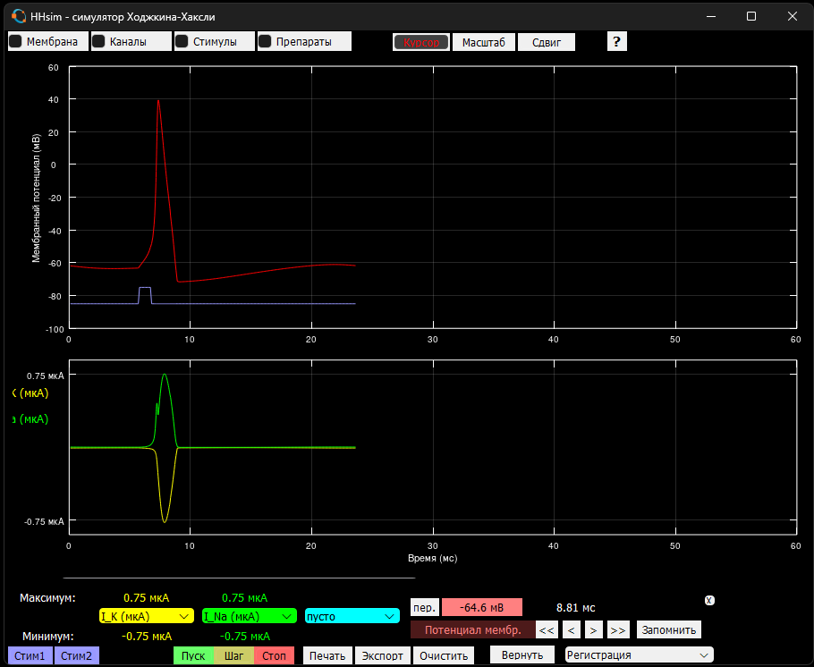

# HHsim — симулятор нейрона Ходжкина–Хаксли (на русском языке)

HHsim — учебная программа по нейрофизиологии. Она показывает, как на мембране нейрона
возникает потенциал действия (спайк), и позволяет менять параметры ионных каналов,
мембраны, стимулов и концентрации ионов, сразу видя результат на графиках.

Программа **бесплатная**. MATLAB для неё **не нужен**.

---

## ⬇️ Скачать

| Ваш компьютер | Ссылка для скачивания |
|---|---|
| 🪟 **Windows** 10 или 11 | **[Скачать HHsim для Windows](https://github.com/rem-aster/HHsim/releases/latest/download/HHsim-3.7-ru-Windows-Installer.exe)** (≈ 300 МБ) |
| 🍎 **Mac** (macOS 11 или новее) | **[Скачать HHsim для Mac](https://github.com/rem-aster/HHsim/releases/latest/download/HHsim-3.7-ru-macOS.zip)** (≈ 1 МБ) |
| 🐧 Linux | [Скачать архив с программой](https://github.com/rem-aster/HHsim/releases/latest/download/HHsim-3.7-ru-source.zip) |

Нажмите на ссылку — файл начнёт скачиваться (обычно в папку «Загрузки»).

---

## 🪟 Установка на Windows

1. Откройте скачанный файл **HHsim-3.7-ru-Windows-Installer.exe**.
2. Если появится синее окно «Windows защитила ваш компьютер», нажмите
   **«Подробнее»**, а затем **«Выполнить в любом случае»**. Это предупреждение
   появляется, потому что программа бесплатная и не покупала «подпись» у Microsoft.
3. В окне установки нажимайте **«Далее»**, затем **«Установить»**.
   Установка занимает несколько минут. Пароль администратора не нужен.
4. В конце нажмите **«Готово»** — HHsim запустится.

**Как запускать потом:** меню **«Пуск»** → **HHsim**, или значок **HHsim** на рабочем столе.

Вместе с программой открывается чёрное окно с сообщениями — это нормально,
не закрывайте его, пока работаете. Чтобы выйти, закройте главное окно HHsim.

---

## 🍎 Установка на Mac

1. Откройте скачанный файл **HHsim-3.7-ru-macOS.zip** — рядом появится программа **HHsim**.
2. Перетащите **HHsim** в папку **«Программы»**.
3. Откройте HHsim двойным щелчком. Mac скажет, что не может проверить программу, —
   нажмите **«Готово»**. Затем откройте **меню Apple** (значок яблока в левом верхнем углу экрана) → **«Системные настройки»** →
   **«Конфиденциальность и безопасность»**, прокрутите вниз и нажмите
   **«Всё равно открыть»** рядом с HHsim. Это нужно сделать только один раз.
   *(На старых macOS: щёлкните по HHsim правой кнопкой мыши → «Открыть» → «Открыть».)*
4. При первом запуске HHsim попросит установить бесплатную программу **GNU Octave**,
   без которой он не работает. Нажмите **«Установить»** — откроется окно «Терминал»:
   * если попросят пароль — введите пароль от вашего Mac и нажмите **Return**
     (при вводе пароля символы не видны — так и должно быть);
   * если попросят нажать RETURN — нажмите **Return**;
   * дождитесь слова **«Готово»** (10–20 минут, нужен интернет) и закройте Терминал.
5. Снова откройте **HHsim** из папки «Программы». Дальше он будет запускаться сразу.

---

## 🐧 Установка на Linux

1. Установите GNU Octave: `sudo apt install octave` (Ubuntu, Debian, Mint)
   или `sudo dnf install octave` (Fedora).
2. Распакуйте скачанный архив и запустите файл `hhsim.sh`.

---

## ❓ Как пользоваться

* Нажмите фиолетовую кнопку **Стим1** — клетка получит импульс тока, и на графике
  появится спайк (красная линия — потенциал мембраны).
* Кнопки **Мембрана**, **Каналы**, **Стимулы**, **Препараты** в верхней части окна
  открывают окна с параметрами. Измените параметр — и моделирование сразу пересчитается.
* Щёлкните по любой линии графика, чтобы узнать точное значение в этой точке.
* Кнопка **?** открывает подробное руководство и упражнения.

Руководство можно прочитать и здесь: [руководство](code/help/guide.html) ·
[курсор](code/help/cursor.html) · [режим фиксации потенциала](code/help/vclamp.html) ·
[упражнения](code/help/exercises.html).

### Что-то не получилось?

* **Windows: ничего не происходит после запуска.** Подождите полминуты — первый запуск
  бывает медленным. Если окно так и не появилось, переустановите программу.
* **Mac: «HHsim повреждён и не может быть открыт».** Откройте программу «Терминал»,
  вставьте строку `xattr -dr com.apple.quarantine /Applications/HHsim.app`,
  нажмите Return и снова откройте HHsim.
* Другие вопросы можно задать на вкладке
  [Issues](https://github.com/rem-aster/HHsim/issues) (нужна регистрация на GitHub).

---

## О программе

Это неофициальная русская версия HHsim 3.7. Авторы оригинала — David S. Touretzky,
Mark V. Albert, Nathaniel D. Daw, Alok Ladsariya и Mahtiyar Bonakdarpour
(Университет Карнеги — Меллона, США). Официальный сайт (на английском):
<https://www.cs.cmu.edu/~dst/HHsim/>.

HHsim — свободная программа, лицензия [GNU GPL](code/COPYING). Для работы используется
бесплатная среда [GNU Octave](https://octave.org); программа по-прежнему запускается
и в MATLAB (R2020a или новее: перейдите в папку `code` и введите `hhsim`).

Разработка оригинала частично поддержана грантом Национального научного фонда США (NSF)
DGE-9987588. Мнения, выводы и рекомендации принадлежат авторам и не обязательно
отражают точку зрения NSF.

### Почитать об уравнениях Ходжкина–Хаксли (материалы на английском)

* [Channeling with Bard](https://www.cs.cmu.edu/~dst/HHsim/bard-channels.pdf) —
  онлайн-учебник G. Bard Ermentrout.
* [Biophysics of Computation](https://christofkoch.com/biophysics-book/), Christof Koch
  ([глава 6](https://christofkoch.files.wordpress.com/2014/01/hodgkin_huxley.pdf)).
* [Theoretical Neuroscience](https://boulderschool.yale.edu/sites/default/files/files/DayanAbbott.pdf),
  Peter Dayan и Larry F. Abbott (глава 5).
* [A Simple Sodium–Potassium Gate Model](https://web.archive.org/web/20040904063242/https://www.ces.clemson.edu/~petersj/BioEng/SimpleGates/index.html),
  James K. Peterson.

Для разработчиков: [DEVELOPERS.md](DEVELOPERS.md).
